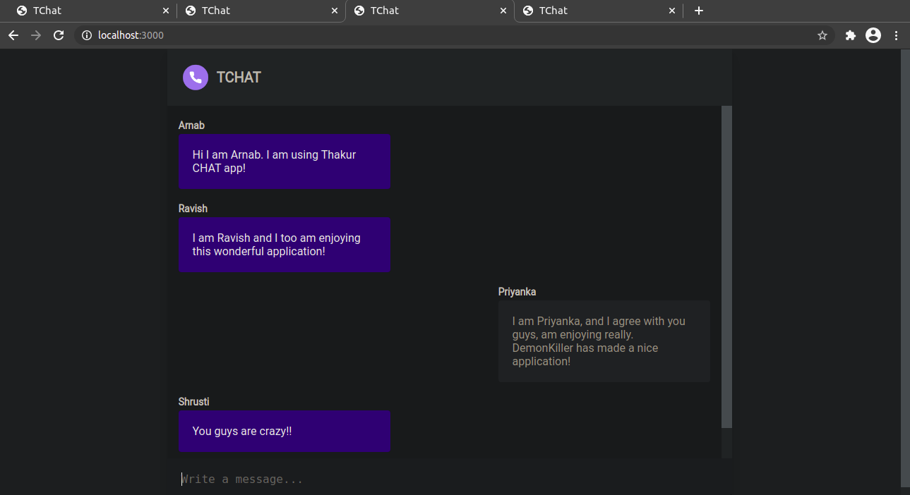
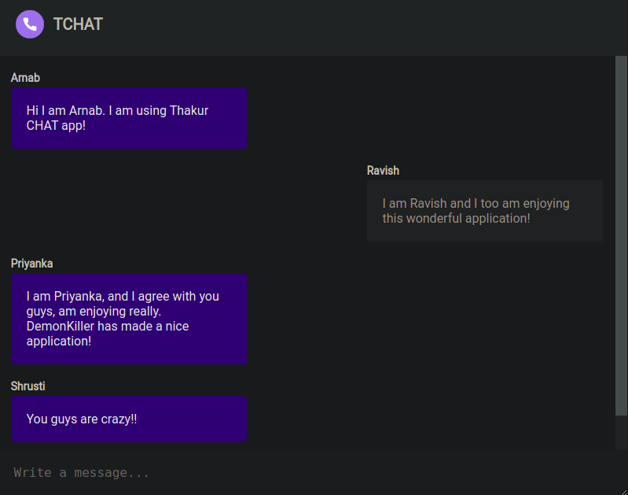

# TCHAT - Realtime Socket.io Chat Application

**TCHAT** or Thakur Chat (named after my college TCET, to impress my teachers), is a simple realtime web chat application developed in **C-H.E.N** stack (CSS, HTML, ExpressJS and Node JS). It uses a powerful Node library called _socket.io_. This project was for ESD-1, conducted in SEM-3.

You need to install Node JS on your computer. For UNIX based systems (Linux, MACOS, BSD, Solaris), run the command

```sh
npm run dev
```

from the tchat directory where you have cloned this repository into. That is, if you clone it in say downloads, then

```sh
cd tchat && npm run dev
```

While socket is running, open your web browser and type in: `localhost:3000`
This will open an instance of the chat application. This application can be run on various devices across various platforms, only condition is they have to be on the same network. (You only need npm running on host machine. All others just need to connect to localhost:3000). You can connect from Windows, any UNIX systems like stated above, as well as android.

NOTE - If you are cloning this on Windows, please see that you have NodeJS installed. On Windows, get VS Code, that simplifies alot of things.



View from other chat member's screen:


